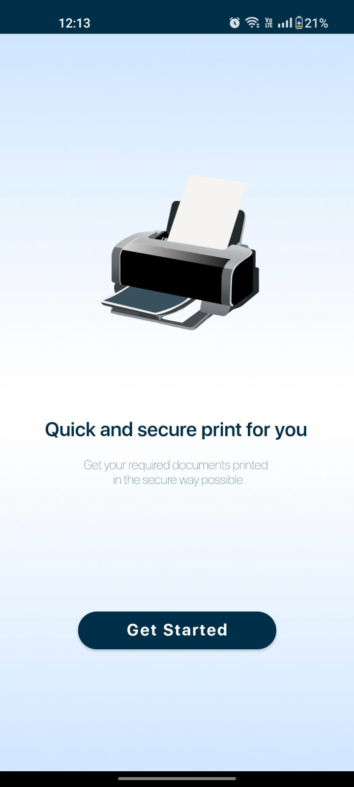
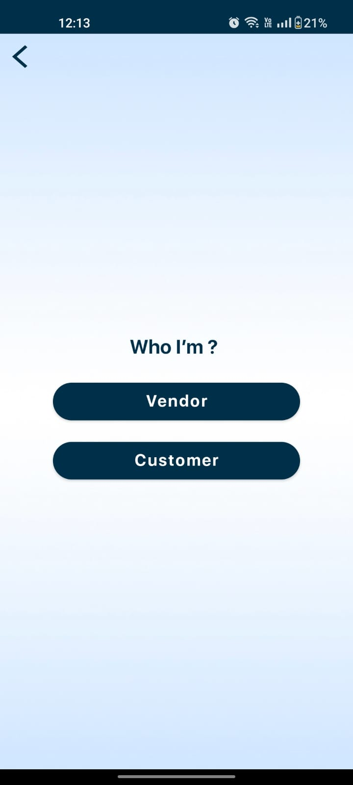
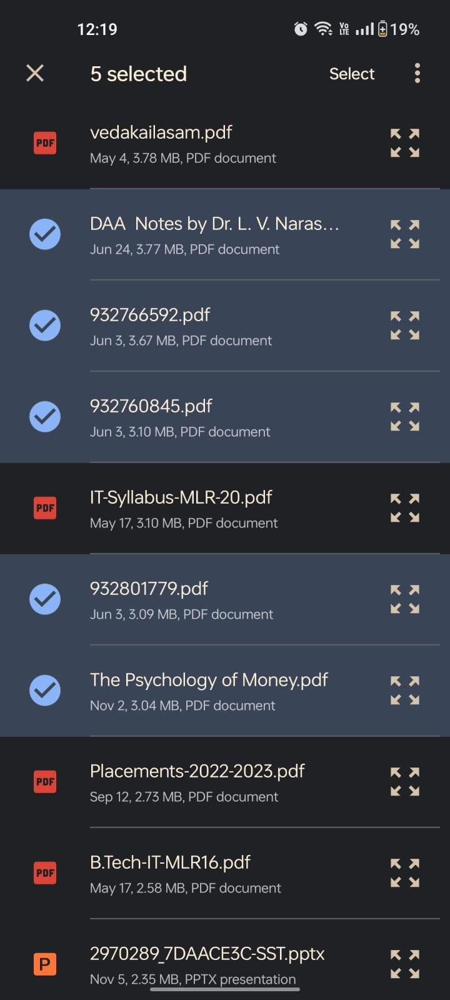
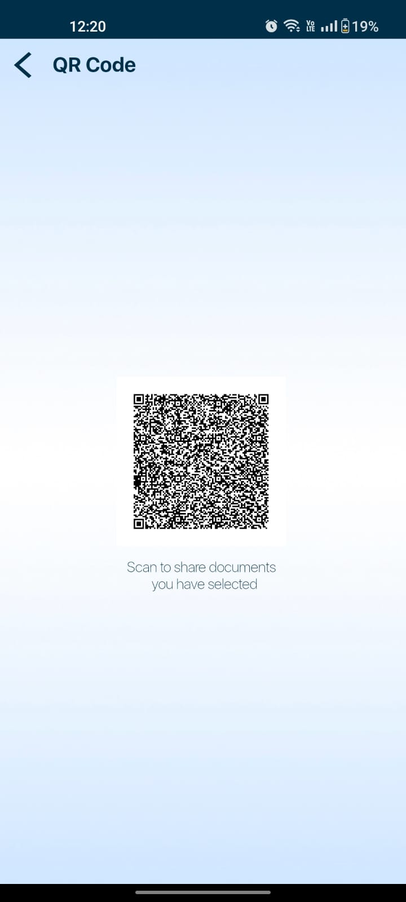
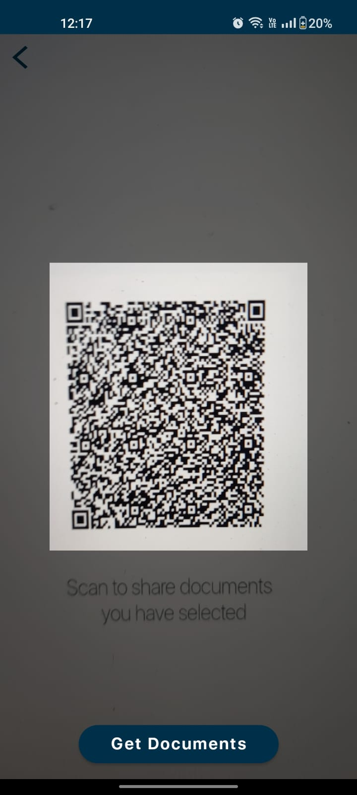
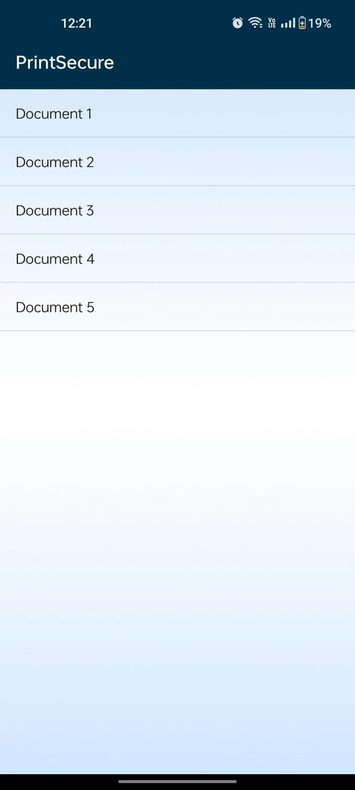
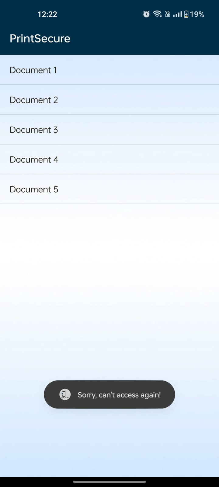
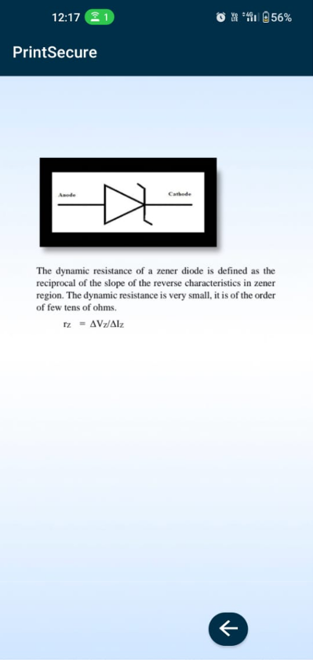

# Print Secure Android Application

The issue related to document confidentiality at printing shops has become a concern for us, especially when printing the sensitive documents stored in our mobiles.
The practice of sending the documents to shops owners via email or WhatsApp raises security issues, regarding the permanent storage in the devices of shop owners.
The realization has forced me for the development of an Android application aimed at solving the aforesaid concerns.
The primary objective is to provide the security by restricting the shop owners from downloading files, capturing screenshots, and providing one-time access.

# Screenshots
Here are the screenshots showcasing the UI and flow of my app.

